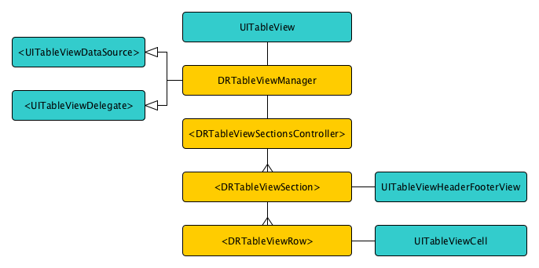

# DRTableViewManager (iOS)

Simple wrapper around `UITableViewDataSource` and `UITableViewDelegate` protocols that allows easy `UITableView` content configuration using blocks or custom objects representing sections and rows.



## Instalation

You can integrate `DRTableViewManager` with your project using Cocoapods. To do so, you will need to add one of the following lines to your Podfile:

For most recent or development version:

    pod 'DRTableViewManager', :git => 'https://github.com/darrarski/DRTableViewManager-iOS.git'

For specific version:

    pod 'DRTableViewManager', :git => 'https://github.com/darrarski/DRTableViewManager-iOS.git', :tag => 'VERSION_TAG'

Where `VERSION_TAG` you should put tag name for given version (ex. "v1.0.0"). It is recommended to set version explicity instead of using most recent version, as backward compatibility is not warranted.

You can also download zip archive of given release from [releases page](https://github.com/darrarski/DRTableViewManager-iOS/releases).

## Usage

Check out included example project.

### Example 1

Shows basic usage, where sections and cells are statically defined in arrays.

### Example 2

Shows basic usage as well, but configures automatic cell heights basing on their content. Works for both iOS 8 (using native `UITableViewAutomaticDimension`) and iOS 7 (computes height with AutoLayout - see source code for details).

### TL;DR

Example usage:

```objective-c
DRTableViewGenericSectionsController *sectionsController = [[DRTableViewGenericSectionsController alloc] init];
sectionsController.sectionsCountBlock = ^NSInteger {
    return 3;
};
sectionsController.sectionAtIndexBlock = ^NSObject <DRTableViewSection> *(NSInteger sectionIndex) {
    return [DRTableViewGenericSection createWithBlock:^(DRTableViewGenericSection *section) {
        section.tableViewTitleForHeaderInSectionBlock = ^NSString *(UITableView *tableView, NSInteger tableSectionIndex) {
            return [NSString stringWithFormat:@"Section %ld", (long)tableSectionIndex];
        };
        section.tableViewHeightForHeaderInSectionBlock = ^CGFloat(UITableView *tableView, NSInteger tableSectionIndex) {
            return 30;
        };
        section.tableViewNumberOfRowsInSectionBlock = ^NSInteger(UITableView *tableView, NSInteger tableSectionIndex) {
            return 3;
        };
        section.rowAtIndexBlock = ^NSObject <DRTableViewRow> *(NSInteger rowIndex) {
            return [DRTableViewGenericRow createWithBlock:^(DRTableViewGenericRow *row) {
                row.tableViewHeightForRowAtIndexPathBlock = ^CGFloat(UITableView *tableView, NSIndexPath *indexPath) {
                    return 44;
                };
                row.tableViewCellForRowAtIndexPathBlock = ^UITableViewCell *(UITableView *tableView, NSIndexPath *indexPath) {
                    UITableViewCell *cell = [[UITableViewCell alloc] init]; 
                    cell.textLabel.text = [NSString stringWithFormat:@"Row %ld", (long)indexPath.row];
                    return cell;
                };
            }];
        };
    }];
};
_tableViewManager = [[DRTableViewManager alloc] initWithSectionsController:sectionsController];
[_tableViewManager registerInTableView:self.tableView];
```

## License

The MIT License (MIT) - check out included [LICENSE](LICENSE) file

